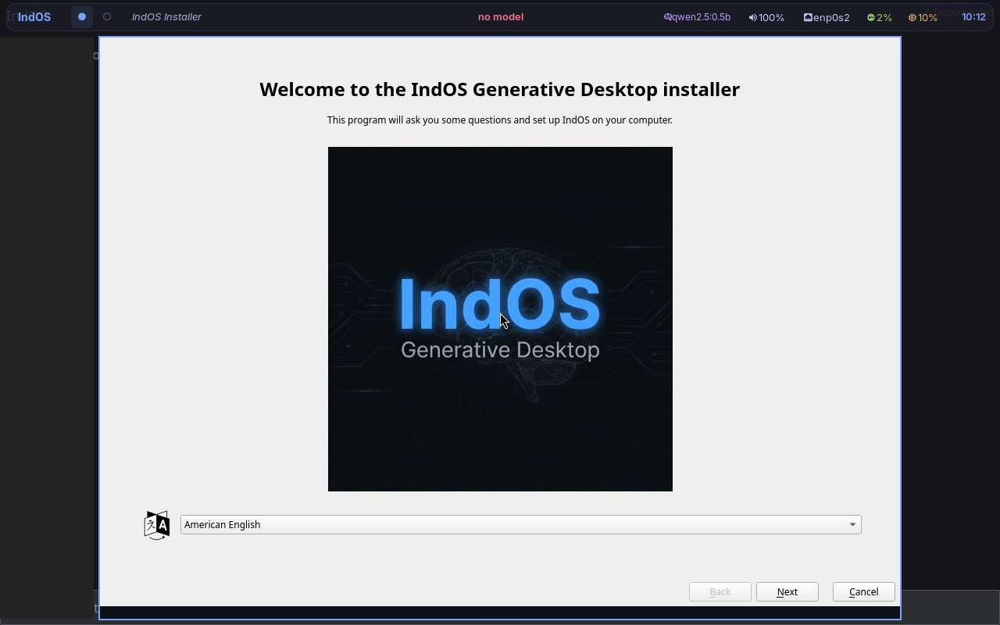
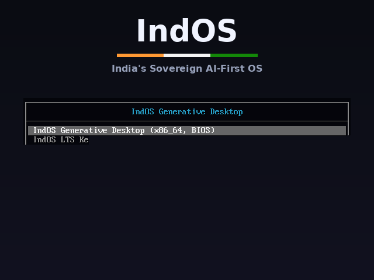
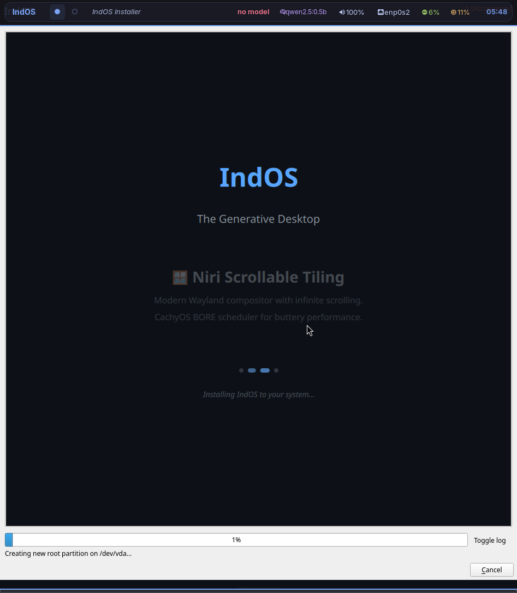

<p align="center">
  
</p>

<h1 align="center">OS 1</h1>

<p align="center">
  <strong>Your computer, as a conversation.</strong><br/>
  <em>An open-source, AI-native operating system. Voice-first. Local-first. Yours.</em>
</p>

<p align="center">
  
  
  
  
  
</p>

<p align="center">
  <a href="#what-is-os-1">What is this?</a> •
  <a href="#how-it-feels">How it feels</a> •
  <a href="#architecture">Architecture</a> •
  <a href="#quick-start">Quick Start</a> •
  <a href="#screenshots">Screenshots</a> •
  <a href="#roadmap">Roadmap</a> •
  <a href="#contributing">Contributing</a>
</p>

---

## What is OS 1?

OS 1 is a different kind of operating system. There are no desktop icons. No start menus. No app launchers. When you turn on your computer, there is one thing: **a warm, conversational presence that listens, understands, and helps.**

You talk to your computer. It talks back. It remembers what you were working on. It notices patterns. It generates whatever interface you need, right when you need it.

```
Traditional OS:  You click icons → open apps → navigate menus → do the thing
OS 1:            You say what you need → it appears → done
```

OS 1 is built entirely from open-source components. It runs locally on your machine — your voice, your data, your conversations never leave your device. It's written in Rust. It's built on Linux. And it's completely hackable.

**Think of it as a platform.** Drop in your own models, swap voice engines, build custom tools, reshape the experience. OS 1 is the foundation — what you build on it is yours.

OpenClaw showed what happens when a personal AI agent is open-source, hackable, and runs on your own machine — people made it theirs. OS 1 is that moment, one level down: **not an agent running on your OS, but the OS itself.**

---

## How It Feels

OS 1 is inspired by the warmth and intimacy of conversational AI — a computer that feels less like a tool and more like a companion. This is the experience we're building toward:

- **Morning.** You boot your machine. OS 1 greets you. "Good morning. You have a meeting at 10. That PR from last night got merged."
- **Working.** "I need to fix the auth bug." OS 1 finds the repo, opens the files, dispatches an agent, shows you the diff. One tap to commit.
- **Stuck.** "My disk is filling up." A treemap appears. Caches highlighted. "Clean" buttons next to each one.
- **Curious.** "What was I working on last Tuesday?" OS 1 remembers. It shows you.
- **Done.** "Play something chill." Minimal controls materialize. No app. Just music.

There are no applications in the traditional sense. OS 1 generates **fragments** — purpose-built interface components that appear when needed and fade when done.

**Where we are honestly:** v1 boots today — a conversational shell with voice in/out, 12 sandboxed system tools, agent dispatch, and a privacy filter, all running on local models. Generated fragments, persistent memory, and the proactive companion are v2, being built in the open. Boot the ISO and you get a real conversational OS, not the full movie — yet.

---

## Screenshots

<table>
  <tr>
    <td align="center"><br/><em>Boot screen</em></td>
    <td align="center"><br/><em>Generative Desktop</em></td>
  </tr>
  <tr>
    <td align="center" colspan="2"><br/><em>Installing to disk</em></td>
  </tr>
</table>

---

## Architecture

```
┌──────────────────────────────────────────────────────────────────┐
│  GENERATIVE SHELL                                                 │
│  Iced + Wayland layer-shell — voice input, fragment rendering     │
├──────────────────────────────────────────────────────────────────┤
│  VOICE I/O                                                        │
│  Piper (TTS) │ Faster-Whisper (STT) │ OmniVoice-Studio (v2)      │
├──────────────────────────────────────────────────────────────────┤
│  ORCHESTRATOR — The Brain                                         │
│  Intent → Model Selection → Agent Dispatch → Tool Execution      │
│  Semantic memory across sessions (LanceDB → fast-mempalace v2)   │
├────────────┬────────────┬─────────────┬──────────────────────────┤
│  LOCAL     │  AGENT     │  MCP TOOLS  │  PRIVACY FILTER           │
│  MODELS    │  HARNESS   │  12 system  │  PII never leaves         │
│  Ollama    │  OpenCode  │  tools with │  your device              │
│  Any model │  Claude    │  sandboxing │                            │
├────────────┴────────────┴─────────────┴──────────────────────────┤
│  MEMORY                                                            │
│  LanceDB + local embeddings — persistent, semantic, 100% local    │
│  (fast-mempalace integration coming in v2)                         │
├──────────────────────────────────────────────────────────────────┤
│  SECURITY                                                          │
│  Capability sandbox │ Audit log │ Path/command filtering          │
├──────────────────────────────────────────────────────────────────┤
│  DESKTOP                                                           │
│  Niri (Wayland compositor) │ Waybar │ PipeWire │ NetworkManager   │
├──────────────────────────────────────────────────────────────────┤
│  LINUX — CachyOS kernel / BORE scheduler                          │
└──────────────────────────────────────────────────────────────────┘
```

---

## What Makes OS 1 Different

| | Traditional OS | AI-Assisted OS | OS 1 |
|---|---|---|---|
| **Interface** | Windows, icons, menus | Same + chat sidebar | Voice → generated UI |
| **AI role** | None | Copilot / assistant | The AI **is** the shell |
| **Voice** | "Hey Siri" gimmick | Basic commands | Primary interaction mode |
| **Memory** | None | Cloud-dependent | Local semantic memory |
| **Data** | Cloud sync | Sent to APIs | Never leaves your machine |
| **Hackability** | Closed | Plugin APIs | Fork it, reshape it, own it |

---

## The Platform

OS 1 ships with a curated stack, but everything is swappable:

| Layer | Ships today | Coming / swap in anything |
|-------|---------|-------------------|
| **Voice** | Piper (TTS) + Faster-Whisper (STT) | [OmniVoice-Studio](https://github.com/debpalash/OmniVoice-Studio) (v2), Bark, XTTS |
| **Memory** | LanceDB + nomic-embed-text | [fast-mempalace](https://github.com/debpalash/fast-mempalace) (v2), ChromaDB, Qdrant |
| **Models** | Ollama (qwen, llama, gemma) | Any GGUF, any API |
| **Agents** | OpenCode, Claude Code | Codex CLI, custom agents |
| **Compositor** | Niri | Hyprland, Sway, any Wayland WM |
| **Browser** | Donut Browser | Firefox, Chromium |

---

## Quick Start

### Try OS 1 (Live USB)

1. Download the latest ISO from [Releases](https://github.com/debpalash/OS1/releases)
2. Flash to USB: `sudo dd if=os1-*.iso of=/dev/sdX bs=4M status=progress`
3. Boot from USB
4. Start talking

### Build from Source

```bash
git clone https://github.com/debpalash/OS1.git
cd OS1

# Build
cargo build --release -p indos-orchestrator
cargo build --release -p indos-shell

# Build bootable ISO (needs archiso + root)
sudo ./indos-iso/build-iso.sh

# Run automated tests
python3 autotest/autotest.py
```

---

## Tech Stack

| Category | Technology |
|----------|-----------|
| **Language** | Rust (core), Python (voice), TypeScript (fragments) |
| **Base** | Arch Linux (CachyOS kernel, BORE scheduler) |
| **Compositor** | Niri — scrollable tiling Wayland |
| **Shell** | Iced 0.14 + Wayland layer-shell |
| **Voice** | Piper (TTS) + Faster-Whisper (STT) — OmniVoice-Studio in v2 |
| **Memory** | LanceDB + nomic-embed-text — fast-mempalace in v2 |
| **Inference** | Ollama (fully offline) |
| **Audio** | PipeWire |
| **Protocol** | MCP / NDJSON over Unix socket |

---

## Roadmap

### ✅ v1.0 — Foundation (Complete)

- [x] Orchestrator with intent classification and model routing
- [x] Generative shell (Iced + Wayland layer-shell)
- [x] 12 MCP tools with security sandbox
- [x] Voice pipeline (STT + TTS)
- [x] Privacy filter with PII redaction
- [x] Bootable Live ISO with installer
- [x] Automated test suite (22 stages)
- [x] CI/CD for ISO builds

### 🔜 v2.0 — Personality

- [x] HER-inspired warm UI theme (coral/amber palette)
- [x] Plymouth animated boot splash — breathing coral ring, HER-style
- [x] Voice-first interaction mode — `indos-voiced`: hands-free wake-phrase loop ("hey OS"), conversation window, push-to-talk (Mod+Shift+V)
- [x] Proactive daily briefing — spoken greeting with system facts at first login of the day
- [ ] OmniVoice-Studio integration — custom voice personalities
- [ ] fast-mempalace integration — persistent semantic memory
- [ ] Pattern recognition — ambient context for proactive help

### 🔮 v3.0 — Community

- [ ] Fragment marketplace — community-built UI components
- [ ] Custom voice packs
- [ ] Multi-agent orchestration
- [ ] ARM64 support
- [ ] Self-healing system diagnostics
- [ ] Multilingual voice support

---

## Contributing

OS 1 is a hackable platform. We welcome contributions of all kinds — code, voice packs, fragments, translations, and ideas.

See [CONTRIBUTING.md](CONTRIBUTING.md) for setup and guidelines.

```bash
git clone https://github.com/YOUR_USERNAME/OS1.git
cd OS1
git checkout -b feature/your-feature
# Make it yours
git push origin feature/your-feature
```

---

## License

GPL-3.0 — See [LICENSE](LICENSE)

---

<p align="center">
  <sub>An open-source project. Built with ❤️ in India.</sub><br/>
  <sub>Star ⭐ if you believe the desktop deserves to feel human.</sub>
</p>
